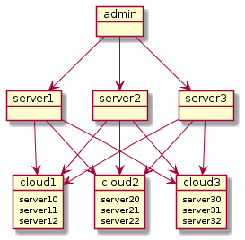

- Download ```plantuml.jar```
<a href="https://plantuml.com/download">Download</a>
```Change Name : plantuml.1.2021.1.jar To plantuml.jar```

- Config ```config.uml```
<pre>@startuml
object admin
object server1
object server2
object server3
object cloud1 {
server10
server11
server12
}
object cloud2 {
server20
server21
server22
}
object cloud3 {
server30
server31
server32
}
admin --> server1
admin --> server2
admin --> server3
server1 --> cloud1
server1 --> cloud2
server1 --> cloud3
server2 --> cloud1
server2 --> cloud2
server2 --> cloud3
server3 --> cloud1
server3 --> cloud2
server3 --> cloud3
@enduml</pre>

- Usage
<pre>java -jar plantuml.jar config.uml</pre>

- Result

